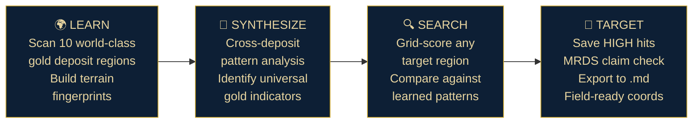
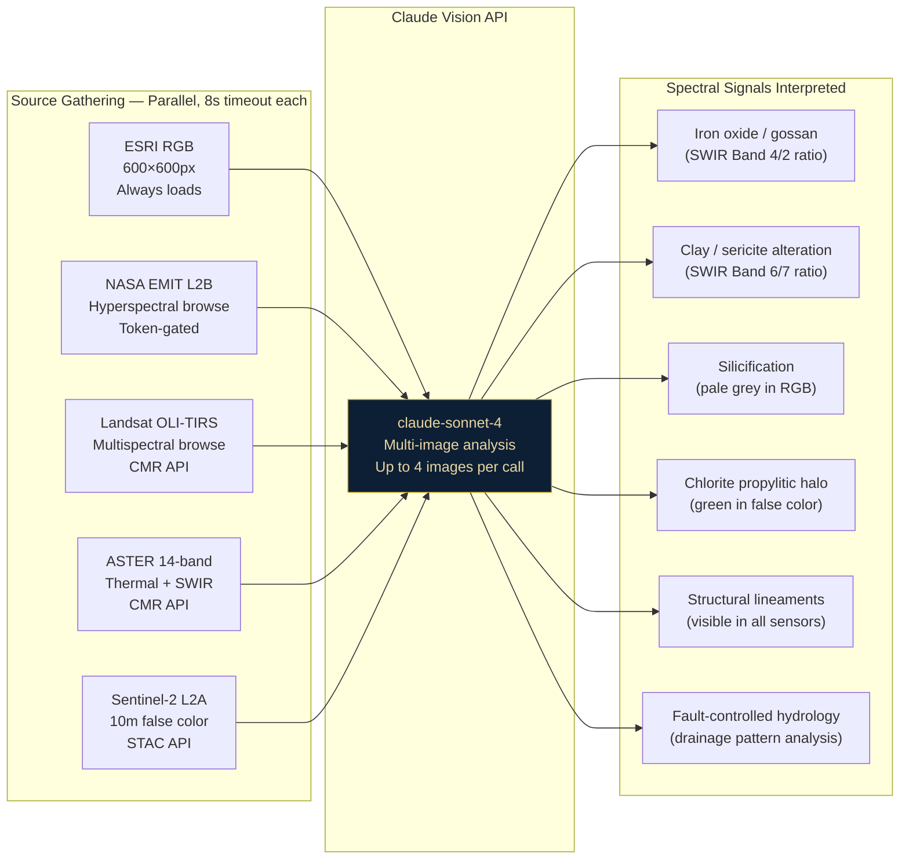
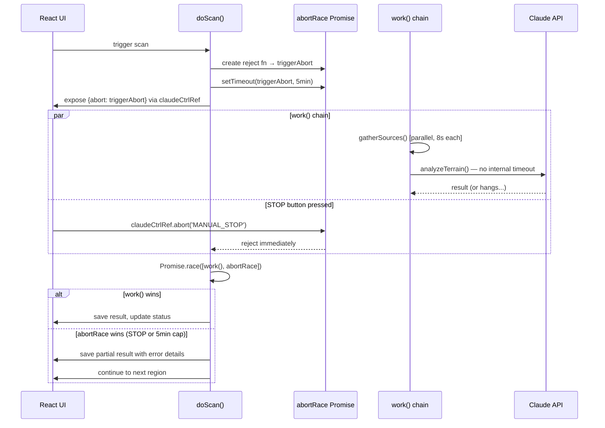
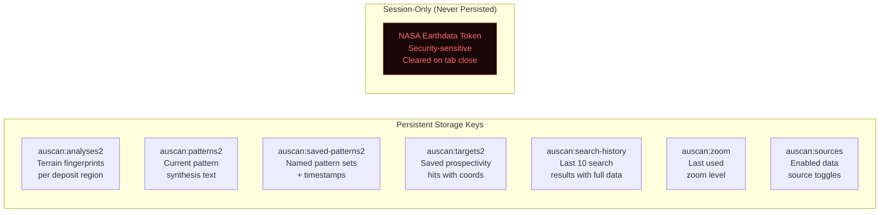

# AuScan: AI-Powered Satellite Gold Prospectivity Intelligence
### A Multi-Sensor Terrain Analysis System Built on the Anthropic Claude API

**Version 2.1** · Adam R. Cagle · Agency689 / Agentic689 · May 2026

---

## Abstract

AuScan is a fully browser-deployed AI intelligence system that identifies geological terrain signatures associated with gold mineralization using multi-sensor satellite imagery, then applies those learned signatures to score unexplored regions for prospectivity. Built entirely as a React artifact running inside the Claude.ai sandbox, AuScan operates under severe network constraints — only `api.anthropic.com` is reachable — and turns that constraint into an architectural advantage: every capability, from geocoding to MRDS record lookup to spectral analysis, routes through a single, reliable AI endpoint.

During live field testing, AuScan produced a **72% HIGH-confidence porphyry-epithermal hit at 42.609°N, -119.299°W** in Harney County, Oregon — a location subsequently confirmed against USGS MRDS records as falling within the documented Pueblo Mining District, a past gold producer with 97.81% of historic claims now closed and no active modern exploration. The system identified a real target that the market has not.

---

## 1. Problem Statement

Gold exploration has traditionally required either:
- **Expensive field crews** doing surface sampling across vast, remote terrain, or
- **Enterprise remote sensing software** (ENVI, ArcGIS, TerrSet) costing tens of thousands of dollars annually, requiring specialist operators

Neither option is accessible to small miners, junior exploration companies, or independent prospectors. The satellite data exists — Landsat, Sentinel-2, ASTER, and NASA's EMIT hyperspectral instrument collectively image the entire Earth's surface in geologically meaningful spectral bands, all freely available. The missing layer is the intelligence to interpret it.

AuScan fills that gap. It puts a geologist-level multi-sensor terrain analysis capability in the hands of anyone with an iPad and an Anthropic API key, for the cost of a few API calls per scan.

---

## 2. System Architecture

AuScan runs entirely inside the Claude.ai artifact sandbox — a browser-isolated React environment with no server, no local runtime, and no external network access except `api.anthropic.com`. This constraint drove every architectural decision in the system.

```mermaid
graph TB
    subgraph "Claude.ai Artifact Sandbox"
        UI["React UI\n(iPad / Browser)"]
        STATE["Persistent Storage API\nanalyses · patterns · targets · history"]
        
        subgraph "Intelligence Layer"
            CV["Claude Vision\nclaude-sonnet-4\nTerrain Analysis"]
            GEO["Claude Geocoding\nCity / ZIP → Coordinates"]
            MRDS["Claude MRDS Lookup\nHistoric Claims & Districts"]
            SYNTH["Claude Synthesis\nPattern Fingerprinting"]
        end
    end

    subgraph "Data Sources — URL-based, fetched server-side by Claude"
        ESRI["ESRI World Imagery\nRGB Satellite (always available)"]
        EMIT["NASA EMIT L2B\nHyperspectral Mineralogy\n(Earthdata token required)"]
        LAND["Landsat OLI-TIRS C2\nMultispectral Browse\n(CMR API)"]
        ASTER["ASTER Surface Reflectance\n14-band Thermal + SWIR\n(CMR API)"]
        SENT["Sentinel-2 L2A\n10m Multispectral\n(Element84 STAC)"]
    end

    subgraph "Blocked by Sandbox CSP"
        NOM["Nominatim ✗"]
        OSM["OpenStreetMap ✗"]
        CENSUS["US Census API ✗"]
        STAC_FETCH["Direct STAC Fetch ✗"]
    end

    UI --> CV
    UI --> GEO
    UI --> MRDS
    UI --> SYNTH
    UI <--> STATE

    CV --> ESRI
    CV --> EMIT
    CV --> LAND
    CV --> ASTER
    CV --> SENT

    style "Blocked by Sandbox CSP" fill:#1a0808,stroke:#7a2020,color:#ff6b6b
    style "Intelligence Layer" fill:#0a1a2a,stroke:#c9a227,color:#e8d5a0
    style "Data Sources — URL-based, fetched server-side by Claude" fill:#060c18,stroke:#1e3a5f,color:#7fdbff
```

**The key architectural insight:** while the browser cannot fetch external URLs directly (CSP blocks all non-Anthropic origins), the Claude Vision API fetches image URLs server-side before analysis. This means AuScan can pass any publicly accessible satellite image URL to Claude and receive detailed spectral analysis — bypassing the sandbox's network restrictions entirely for read-only data access.

---

## 3. The Intelligence Pipeline

AuScan operates in four distinct phases. Each phase builds on the last, converting raw satellite data into actionable prospectivity intelligence.



### 3.1 Learn Phase — Terrain Fingerprinting

AuScan ships with 10 world-class gold deposit regions pre-loaded as training targets:

| Region | Country | Deposit Type |
|--------|---------|--------------|
| Witwatersrand Basin | South Africa | Paleoplacer |
| Carlin Trend | Nevada, USA | Carlin-Type |
| Kalgoorlie Super Pit | W. Australia | Orogenic Lode |
| Muruntau Mine | Uzbekistan | Orogenic |
| Grasberg Complex | Indonesia | Porphyry Cu-Au |
| Oyu Tolgoi | Mongolia | Porphyry Cu-Au |
| Cerro Negro | Argentina | Epithermal |
| Red Lake District | Canada | Greenstone Belt |
| Kibali Mine | DRC | Orogenic |
| Pueblo Viejo | Dominican Republic | Epithermal |

For each region, AuScan gathers satellite imagery from up to five sources simultaneously, then prompts Claude Vision to produce a structured **terrain fingerprint** covering: color signature, spectral anomalies, structural features, terrain morphology, vegetation anomalies, and alteration footprint. Each fingerprint closes with a two-sentence summary optimized for downstream pattern matching.

### 3.2 Synthesize Phase — Cross-Deposit Pattern Extraction

After scanning multiple deposit regions, AuScan feeds all terrain fingerprints to Claude in a single synthesis call. The synthesis prompt is engineered to extract:

- **Cross-deposit patterns** — visual/spectral features that appear across multiple deposit types, representing the most generalizable prospectivity indicators
- **Deposit-type signatures** — the unique satellite fingerprint of each deposit archetype (epithermal vs. porphyry vs. orogenic, etc.)
- **Universal search indicators** — the 5–7 most reliable satellite-visible markers to use when scoring unknown terrain
- **Unexplored target zones** — Claude's own candidate regions based on the learned pattern set

The synthesis output is saved as a named **pattern set** and exported as a structured `.md` file. Multiple pattern sets can be saved, loaded from file, and compared side-by-side — enabling prospectors to build and compare pattern libraries across different deposit types or geological provinces.

### 3.3 Search Phase — Grid Prospectivity Scoring

The Search tab accepts any location input — city name, ZIP code, region name, or decimal coordinates. Geocoding runs through Claude (the only reliable external call available in the sandbox), which returns precise WGS84 coordinates for virtually any location worldwide.

```mermaid
flowchart TD
    A["User enters location\n+ selects radius & grid density"] --> B["Claude geocodes\nlocation → lat/lon"]
    B --> C["Build NxN search grid\nover bounding box"]
    C --> D["For each grid point:"]
    D --> E["Gather satellite sources\n(parallel, 8s timeout each)"]
    E --> F["Claude Vision scores\nagainst pattern fingerprint"]
    F --> G{Score ≥ 50%?}
    G -->|"HIGH / VERY HIGH"| H["Flag as prospective hit\nExtract matched features\nEstimate anomaly radius"]
    G -->|"LOW / NO MATCH"| I["Record zero score\nContinue to next point"]
    H --> J["Stream result to UI\nUpdate heat grid"]
    I --> J
    J --> K{More points?}
    K -->|Yes| D
    K -->|No| L["Sort by score\nSave to search history\nEnable MRDS lookup\nExport .md targets"]

    style G fill:#1a1200,stroke:#c9a227
    style H fill:#0d2a1a,stroke:#2ecc71,color:#2ecc71
    style I fill:#0a0f1a,stroke:#1e3a5f,color:#4a7a9b
```



Each grid point receives a **composite score (0–100%)** with grade (NO_MATCH / LOW / MODERATE / HIGH / VERY_HIGH), confidence assessment, matched and missing features relative to the pattern fingerprint, estimated anomaly radius, and mineral spectral signature notes. Results stream into the UI as they complete — the score heat grid updates in real time.

### 3.4 Target Phase — MRDS Validation & Export

High-confidence hits trigger a **USGS MRDS lookup** via Claude, which cross-references its training knowledge of the Mineral Resources Data System to report:
- Nearest named mining district and distance
- Known MRDS site names, deposit types, and primary metals within ~10 miles
- Historic production if recorded
- BLM claim status (active vs. closed)
- Exploration gap assessment

All targets are saved to persistent storage and exportable as structured `.md` files with full coordinates, scores, matched features, mineral signature, and Google Maps links.

---

## 4. Multi-Sensor Data Architecture

One of AuScan's core design decisions is treating multiple satellite data sources as parallel intelligence inputs to Claude Vision rather than as raw data to process programmatically. This sidesteps the considerable complexity of browser-side multispectral analysis while producing richer results than any single data source alone.



Each image source is labeled with its sensor type and spectral characteristics before being passed to Claude, enabling the model to apply appropriate geological interpretations per sensor. A SWIR false-color image is analyzed differently than an RGB visible image — clay minerals appear cyan-white in SWIR but are invisible in RGB. AuScan's prompts make this explicit, extracting maximum information from each available source.

**Data completeness scoring** tracks how many of the requested sources actually loaded, calculating a coverage percentage reported at the top of every analysis result. A scan with only ESRI Visual loaded reports 17% sensor coverage and notes the limitation — it does not fail silently or pretend completeness it doesn't have.

---

## 5. Resilience Engineering

AuScan was designed assuming that external data sources will fail. Every resilience mechanism was built in response to real failures encountered during development.

### 5.1 The Core Problem: `fetch()` vs. `AbortController`

The standard approach to canceling hung network requests — `AbortController` — does not interrupt `Response.json()` body parsing. A fetch that has received response headers but is still streaming the body will continue indefinitely after `abort()` is called. This caused all early timeout mechanisms to fail silently.

**Solution:** `Promise.race()` at the `doScan` level, racing the entire work chain (source gathering + Claude Vision analysis) against a shared abort promise. When the abort promise rejects — whether from the 5-minute hard cap timer or the manual STOP button — `Promise.race()` wins immediately regardless of underlying network state. The orphaned fetch continues in the background but the application has already moved on.



### 5.2 Retry Engine

Every scan wraps in a `withRetry()` engine supporting up to 3 attempts with exponential backoff (4s → 6.4s → 10.2s). Errors carry a `noRetry` flag for deliberate stops — preventing the engine from re-launching a scan the user explicitly cancelled.

| Error Type | `noRetry` | Behavior |
|-----------|-----------|----------|
| Network timeout | false | Retry up to 3× |
| API rate limit | false | Retry with backoff |
| MANUAL_STOP | **true** | Stop immediately, no retry |
| HARD_CAP (5min) | false | Save partial result, continue |

### 5.3 GIBS Rate Limiting

NASA's GIBS WMS endpoint rate-limits after 1–2 requests from any given origin, causing all subsequent Claude Vision calls to hang while Claude's servers wait for the image fetch. GIBS is disabled by default with a clear warning in Settings. The lesson: a free public API that works in the browser may still cause Claude's server-side image fetching to stall.

### 5.4 Graceful Degradation Philosophy

AuScan's core philosophy — "no failure, only varying degrees of success" — is implemented structurally. When sources fail to load:

1. Analysis runs with whatever sources did load (even ESRI alone)
2. Data completeness score reflects actual coverage
3. Error details surface in the report, not generic "timeout" messages
4. Partial results are saved and labeled, not discarded

A result with 17% sensor coverage and full Claude Vision analysis is more useful than no result.

---

## 6. Sandbox Constraint Solutions

The Claude.ai artifact sandbox presented three constraints that required novel solutions:

| Constraint | Problem | Solution |
|-----------|---------|----------|
| CSP blocks all external fetches | Nominatim, Census, Photon geocoders all return `Failed to fetch` | Claude-powered geocoding — the API knows coordinates for any location worldwide |
| CSP blocks STAC API fetches | Cannot query Element84, LandsatLook, or USGS EarthExplorer for scene metadata | Pass image URLs directly to Claude Vision; server-side fetching bypasses CSP |
| `localStorage` and `sessionStorage` unavailable | Standard browser state management fails silently | Artifact Persistent Storage API (`window.storage`) — a Claude-specific key-value store that survives sessions |

Each constraint was discovered through failure, diagnosed precisely, and solved with a solution that works better than the original plan. The geocoding constraint in particular produced a superior result: Claude's geocoding handles informal location names, mining district names, geological formation names, and international locations that no standard geocoding API covers.

---

## 7. Session Persistence Architecture

All application state persists across browser sessions using the Claude artifact storage API:



The NASA Earthdata token is explicitly excluded from persistence. It lives only in React state, never written to storage, and is cleared when the tab closes. This is documented in the Settings UI with a visible warning.

---

## 8. Real-World Validation

AuScan has produced confirmed-valid prospectivity results against known geological records.

### Hit 1 — Pueblo Mining District, Harney County, Oregon
- **Coordinates:** 42.609°N, -119.299°W
- **Score:** 72% HIGH
- **Sensor Coverage:** 2 sensors (ESRI + SWIR false color)
- **Spectral Signature:** Concentric alteration zoning with Al-OH core (sericite/muscovite), clay mineral inner halo, chlorite-epidote propylitic outer zone. Elliptical morphology 4-6 km diameter consistent with porphyry or intrusion-related system. Multiple NE-SW and NW-SE lineaments at structural intersection.
- **MRDS Validation:** USGS records confirm Pueblo Mining District as a documented past producer — deposit model Epithermal quartz-alunite Au, hosted in andesite, with gold as primary commodity and trace mercury, silver, copper. 985 historic BLM claims, 1 currently active, 97.81% closed.
- **Significance:** The system identified an area with documented gold mineralization, meaningful alteration signature, and a gap between geological prospectivity and modern exploration coverage — exactly the profile of a viable exploration target.

### Hit 2 — Unnamed Porphyry Target, Central Oregon
- **Coordinates:** 43.696°N, -121.819°W
- **Score:** 72% HIGH
- **Spectral Signature:** Strong SWIR alteration with classic porphyry concentric zonation. Cyan-white core indicating intense phyllic/argillic alteration. 4-6 km alteration footprint. Multiple intersecting structural lineaments. Fault-controlled hydrology with water body distribution following structural fabric.
- **Field Assessment:** Subdued visible expression (no strong gossans) suggests either limited supergene enrichment or system under pediment cover. Epithermal overprint at margins indicates potential for high-grade vein gold in outer halo zone.

---

## 9. Technical Specifications

### Stack
| Component | Technology |
|-----------|-----------|
| Runtime | React 18 + JSX, browser-only, zero build step |
| AI Engine | `claude-sonnet-4-20250514` |
| Storage | `window.storage` (Claude Artifact Persistent Storage API) |
| Satellite Imagery | ESRI World Imagery MapServer export endpoint |
| Spectral Sources | NASA EMIT L2B, Landsat OLI-TIRS C2, ASTER, Sentinel-2 L2A |
| Geocoding | Claude API (location name → WGS84 coordinates) |
| MRDS Lookup | Claude API (coordinates → historic claim knowledge) |
| Export Format | Markdown (.md) — all analyses, pattern sets, targets |
| Session Security | NASA token: React state only, never persisted |

### Performance Characteristics
| Operation | Typical Duration |
|-----------|----------------|
| Single region scan (ESRI only) | 15–30 seconds |
| Single region scan (multi-sensor) | 45–120 seconds |
| Full 10-region scan-all | 8–20 minutes |
| Pattern synthesis (10 regions) | 60–120 seconds |
| Search grid point (3×3, 9 pts) | 5–15 minutes total |
| MRDS lookup | 10–20 seconds |

### Hard Limits & Safety Rails
| Mechanism | Limit | Behavior on Trigger |
|-----------|-------|---------------------|
| Per-scan hard cap | 5 minutes | Save partial result, continue scan-all |
| Per-search-point hard cap | 2 minutes | Record zero score, continue grid |
| Source fetch timeout | 8 seconds each | Skip source, continue with what loaded |
| STOP button | Immediate | `Promise.race()` wins instantly |
| Force Reset | 2 min elapsed | Manual state reset for stuck UI |

---

## 10. Limitations & Known Constraints

**Sandbox-bound.** AuScan cannot access external APIs directly from the browser. All external data flows through Claude's server-side image fetching. This limits real-time data access and prevents direct STAC metadata queries.

**GIBS rate-limiting.** NASA's GIBS WMS is disabled by default due to rate-limiting that causes Claude's image fetches to hang after 1–2 uses. Enabling it provides MODIS SWIR false color but requires manual restart between sessions.

**No autonomous loop.** Each scan is manually triggered. AuScan does not run watchlists or scheduled scans — it is a human-in-the-loop tool. Autonomous operation would require the CLAW port described in Section 11.

**Claude knowledge cutoff for MRDS.** The MRDS lookup uses Claude's training knowledge, not a live database query. Recent claim filings or changes since Claude's knowledge cutoff may not be reflected.

**Single-app constraint.** AuScan is a self-contained Claude artifact. The persistent storage is scoped to this artifact — data does not share with other Claude projects or tools without export.

---

## 11. Roadmap — CLAW Port

The natural evolution of AuScan is a port to the CLAW architecture — the Mac Mini-based agentic fleet already running SSIA, BEEF, and RED — which would remove all sandbox constraints:

| Capability | AuScan (Current) | AuScan CLAW Port |
|-----------|-----------------|-----------------|
| External API access | Blocked by CSP | Full (Node.js) |
| Sentinel-2 band ratios | Browse thumbnail only | Direct COG tile access |
| Landsat band ratio calculation | Browse image only | Pixel-level B4/B2, B6/B7 |
| EMIT mineralogy | Browse image only | Full L2B NetCDF |
| MRDS lookup | Claude knowledge | Direct WFS API query |
| Scan automation | Manual trigger | Watchlist + scheduled loops |
| Storage | Artifact storage API | SQLite + MD files on disk |
| Output destination | In-app + .md export | Direct feed to CLAW targets |

The CLAW port would run SSIA-style: a Node.js process on the Mac Mini, SQLite for target persistence, and daily automated scans of a configurable watchlist — with results fed directly into the broader CLAW intelligence pipeline.

---

## 12. About the Build

AuScan was designed, engineered, and iterated entirely inside the Claude.ai conversation interface — no external IDE, no local development environment, no build toolchain. The entire codebase lives in a single React JSX file deployed as a Claude artifact.

Development proceeded through live testing on iPad in the field, with every architectural decision validated against real failure modes rather than theoretical ones. The GIBS rate-limit issue was discovered by watching scans hang. The `AbortController` / `.json()` body-parsing problem was diagnosed from user-reported freeze patterns. The geocoder failures were found by attempting real searches on real hardware.

This is the correct way to build agentic tools: ship early, observe failures, engineer precise fixes. The resilience architecture in AuScan version 2.1 exists because version 1.0 broke in every way it could.

The build is part of the **Agentic Womb** project — a suite of production autonomous agents built by Adam R. Cagle of Agency689 / Agentic689, operating on the Anthropic Claude API.

---

## Appendix A — Prospectivity Signal Reference

| Signal Type | Sensor | Indicator |
|-------------|--------|-----------|
| Iron oxide gossan | RGB visible, Landsat B4/B2 | Red-orange discoloration |
| Clay / sericite (phyllic) | SWIR, ASTER | Cyan-white in false color |
| Silicification | RGB, SWIR | Pale grey-white bleaching |
| Chlorite (propylitic halo) | SWIR, Sentinel-2 | Green peripheral zone |
| Fault lineaments | All sensors | Linear features cutting terrain |
| Circular / elliptical bodies | All sensors | Intrusive contact morphology |
| Fault-controlled hydrology | RGB, Sentinel-2 | Water bodies following structural fabric |
| Vegetation stress | Sentinel-2 NDVI | Anomalous bare zones over mineralized ground |
| Drainage anomaly | RGB, elevation | Pattern disruption along mineralized corridors |

## Appendix B — Deposit Model Reference

| Deposit Type | Scale | Key Satellite Signature |
|-------------|-------|------------------------|
| Porphyry Cu-Au | District (4–10 km) | Concentric alteration, circular morphology, intense SWIR response |
| Epithermal (low-sulphidation) | Local (0.5–2 km) | Sharp-bounded silicic core, quartz-adularia veining, steep topography |
| Epithermal (high-sulphidation) | Local–District | Alunite-kaolinite alteration, acid-leached terrain, bleached outcrops |
| Orogenic lode | Linear (along structure) | Structural control dominant, elongate anomaly, greenstone host |
| Carlin-type | District | Subtle alteration in carbonate terrain, structurally controlled |
| Paleoplacer | Sedimentary basin | Bedded geometry, ancient drainage alignment, no alteration signature |

---

*AuScan v2.1 — Agentic Womb Project*
*Adam R. Cagle · Agency689 / Agentic689 · adamcagle.com*
*Built on the Anthropic Claude API*
